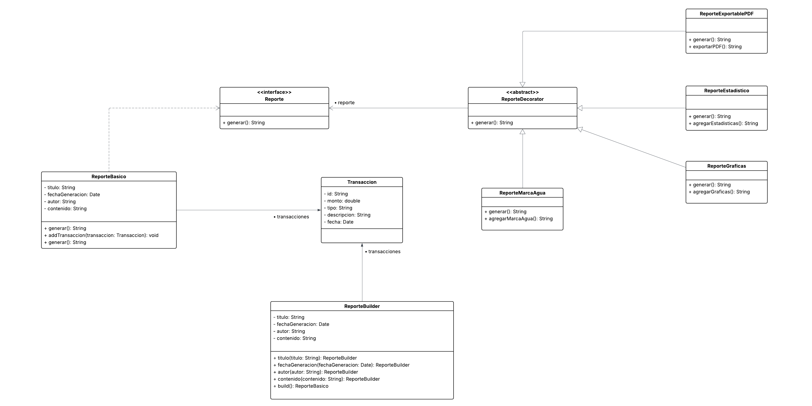

# Taller Evaluativo #2

- **Rama:** `develop`

## 👥 Desarrolladores
- KAROL ESTEFANY ESTUPIÑAN VIANCHA
- SERGIO ALEJANDRO IDARRAGA TORRES
- JULIAN DAVID CASTIBLANCO REAL
- SANTIAGO CARMONA PINEDA
- JUAN CARLOS LEAL CRUZ

## 📋 Descripción
El Gestor de Tareas Colaborativo es un sistema de reportes financieros diseñado para empresas fintech que buscan ofrecer a sus clientes informes dinámicos, personalizables y fáciles de generar. Este sistema permite a los usuarios crear reportes detallados que incluyen información básica como título, fecha de generación, autor, lista de transacciones y contenido.

Gracias a la implementación de patrones de diseño como Builder y Decorator, los reportes pueden construirse paso a paso y extenderse dinámicamente con funcionalidades adicionales, tales como:
- Inclusión de gráficas.
- Aplicación de marcas de agua de seguridad.
- Generación de resúmenes estadísticos.
- Exportación a formatos PDF o Excel.

El sistema también permite listar todos los reportes generados y filtrarlos por fecha mediante Streams, garantizando eficiencia y flexibilidad en la gestión de la información. Todos los reportes se persisten en MongoDB, asegurando almacenamiento confiable y escalable.

El desarrollo sigue buenas prácticas de Gitflow, principios SOLID y arquitectura en capas, garantizando un código mantenible, modular y de alta calidad.

## Diagramas

- Diagrama de clases:
- 

